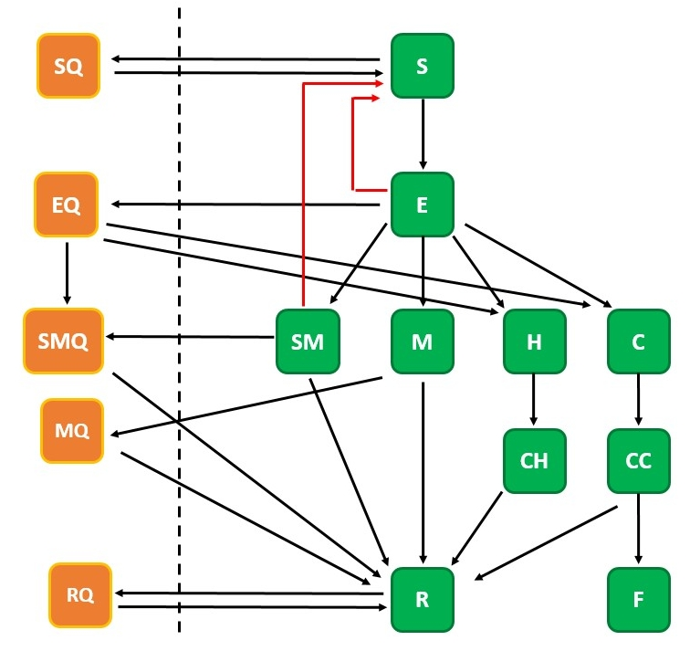
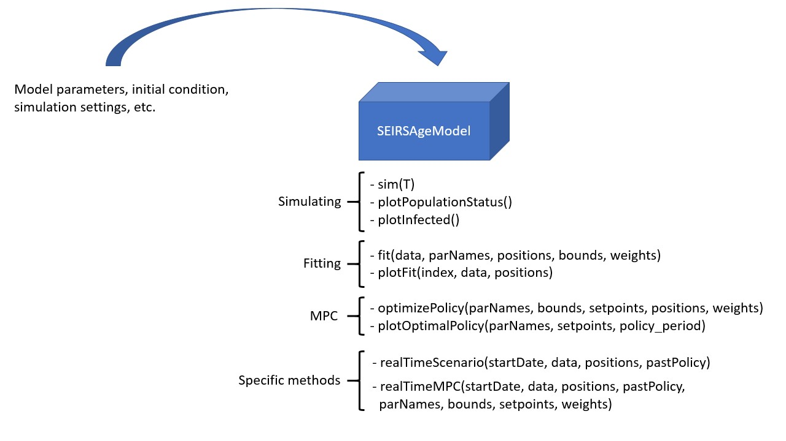
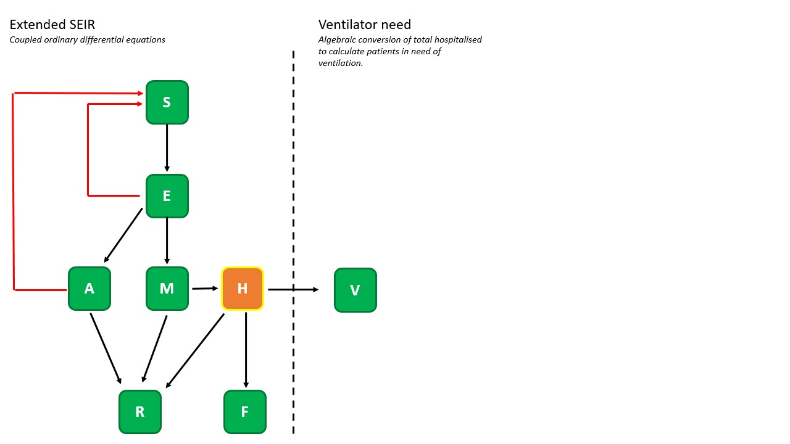
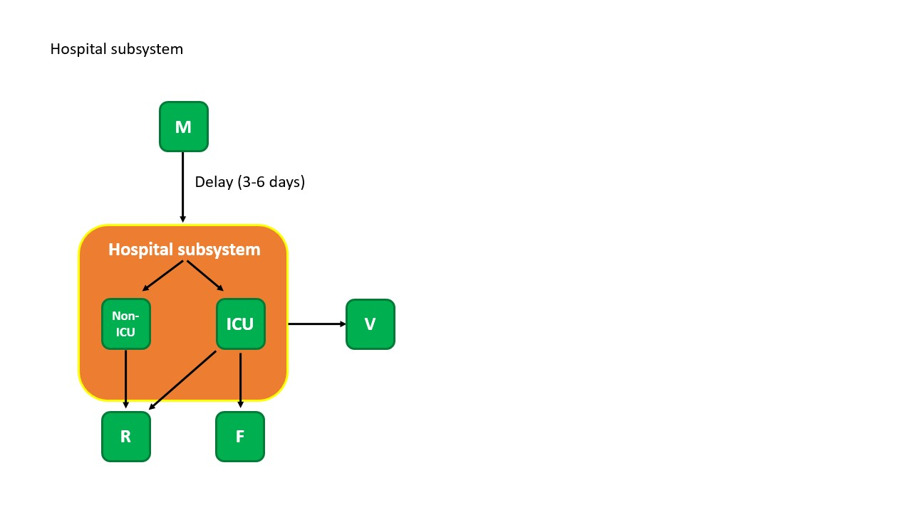

# Biomath COVID19-Model

*Original code by Ryan S. McGee. Modified by T.W. Alleman in consultation with the BIOMATH research unit headed by prof. Ingmar Nopens.*

Copyright (c) 2020 by T.W. Alleman, BIOMATH, Ghent University. All Rights Reserved.

Our code implements a SEIRS infectious disease dynamics models with extensions to model the effect quarantining detected cases. Using the concept of 'classes' in Python 3, the code was integrated with our previous work and allows to quickly perform Monte Carlo simulations, calibrate model parameters and calculate an *optimal* government policies using a model predictive controller (MPC). A white paper and souce code of our previous work can be found on the Biomath website. 

https://biomath.ugent.be/covid-19-outbreak-modelling-and-control

## Model highlights

### Model dynamics
We use an extended version of the SEIR model to model the disease at a higher resolution. This classic SEIR model splits the population into different categories, i.e. susceptible, exposed, infected and removed. We break down the latter two categories in super mild (asymptotic), mild, heavy and critical for the infected part of the population, whereas the removed population indicates the immune and dead fraction. Parameters values are (for now) based on Chinese covid-19 literature but we are seeking to closer collaborate with Belgian hospitals as more data becomes available. The model can run age-structured (metapopulation) simulations naturally by changing the initial conditions.

### Additional capabilities
As of now (18/04/2020), the SEIRSAgeModel contains 7 functions which can be grouped in two parts: 1) functions to run and visualise simulations and 2) functions to perform parameter estimations and visualse the results. 3) functions to optimize future policies using model predictive control (MPC).  Also, scenario specific functions will be added over the course of next week. 

## How to use the model

A Jupyter Notebooks containing all scientific details and a tutorial is available in the /src folder.

## Future work

### Model dynamics

Future work will include a modification of the model dynamics according to the flowchart below. We believe these allow to simulate even more realisticly. Available data from Belgian hospitals will be used.

### Stochastic model
Implementing the class-based functions available in the SEIRSAgeModel for Monte-Carlo sampling, calibration and model predictive control in the stochastic model framework.

### Scenario-specific functions
 We will implement a function which uses the past policies to quickly recreate the Belgian ICU and hospitalisation curves up-to-date. This function will be used to quickly propose MPC optimal policies and to perform scenario analysis about the future.